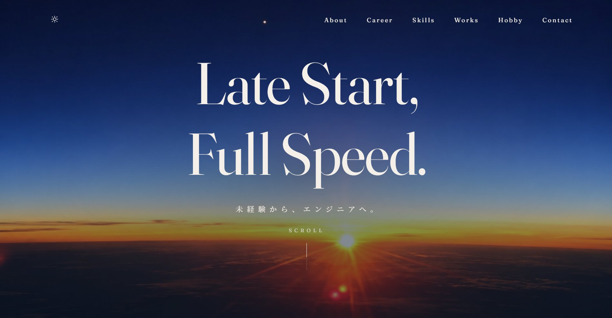
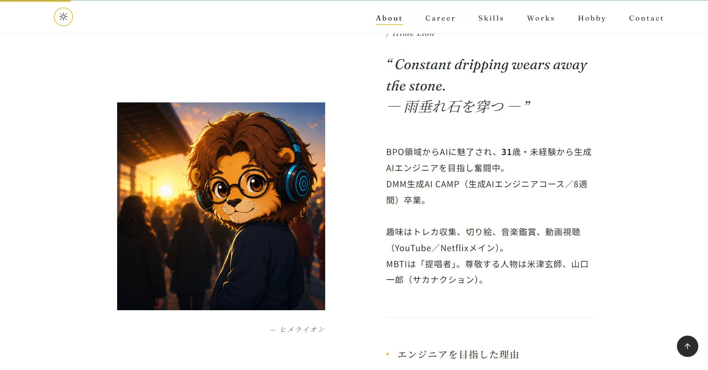
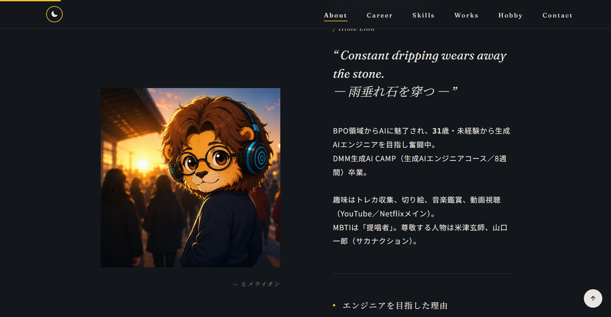
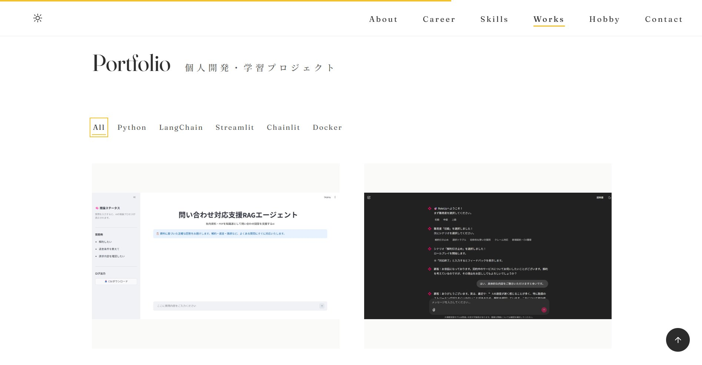
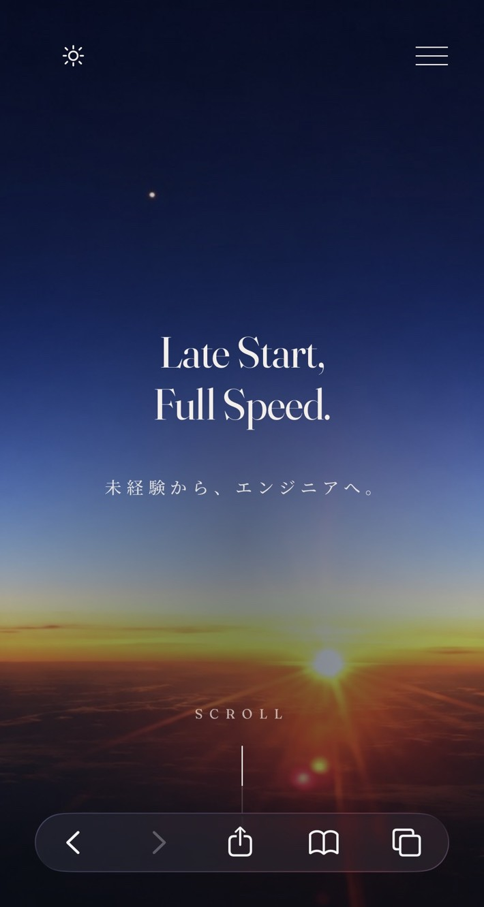
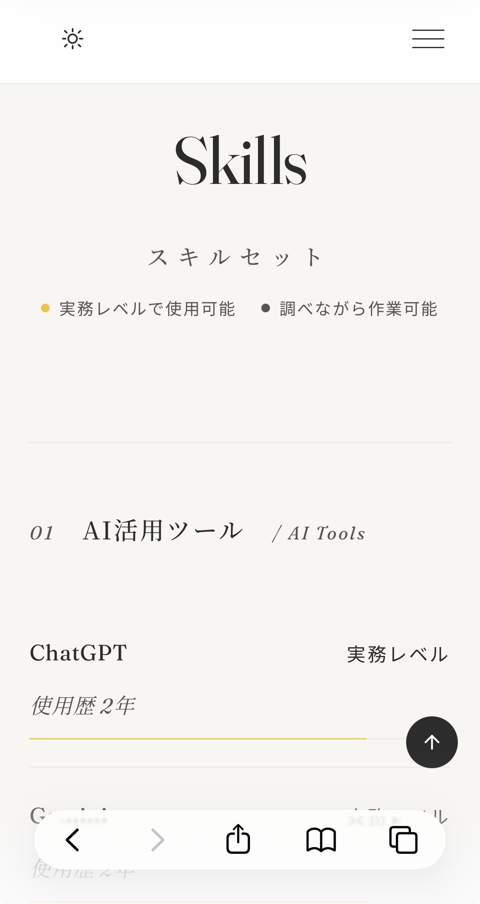

# Portfolio Site

## 🎯 概要

未経験からAIエンジニアを目指すポートフォリオサイトです。  
HTML / CSS / JavaScript のみで構成したシングルページサイトで、自己紹介・職務経歴・スキルセット・制作実績・趣味を掲載しています。

---

## 🚀 デプロイ

| 項目 | 内容 |
|---|---|
| ホスティング | Cloudflare Workers |
| URL | https://portfolio-site.biguver.workers.dev/ |

---

## 🎓 目的

- エンジニア転向の意思と経緯を伝えるポートフォリオとして制作
- HTML / CSS / JavaScript の基礎力を実践的に習得・証明する
- 採用担当者・クライアントへの第一印象となる「名刺」として活用する

---

## 🖼️ プレビュー

### Hero



### ライト / ダークモード

| Light | Dark |
|---|---|
|  |  |

### Works（カテゴリフィルタ）



### モバイル表示

<table>
<tr>
<td></td>
<td width="24"></td>
<td></td>
</tr>
</table>

---

## 📁 ディレクトリ構成

```
portfolio-site/
├── index.html              # メインHTML（全セクション）
├── wrangler.jsonc          # Cloudflare Workers（静的アセット配信）設定
├── .gitignore
├── README.md
├── .github/
│   └── readme/             # README用プレビュー画像（`.`始まりのため本番デプロイ対象外）
└── assets/
    ├── css/
    │   └── style.css       # 全スタイル（変数・レイアウト・アニメーション・レスポンシブ）
    ├── js/
    │   └── script.js       # インタラクション（ナビ・スクロール・アコーディオン・パララックス）
    └── images/
        ├── about/          # プロフィール画像
        ├── hero/           # ヒーロー背景画像
        ├── hobby/          # 趣味（切り絵）画像
        └── works/          # 制作実績画像・動画
```

---

## 🧩 機能・技術スタック

### 基盤

| カテゴリ | 技術 |
|---|---|
| マークアップ | HTML5 |
| スタイリング | CSS3（カスタムプロパティ・Grid・Flexbox・アニメーション） |
| スクリプト | JavaScript（Vanilla ES6+） |
| フォント | Google Fonts（Fraunces / Noto Sans JP / Noto Serif JP） |
| レスポンシブ | メディアクエリ（PC / タブレット / スマホ対応） |
| ホスティング | Cloudflare Workers |
| バージョン管理 | Git / GitHub |

### 実装した機能

サイト自体はHTML/CSS/JavaScriptのみで構成されていますが、JavaScriptでのインタラクション実装に力を入れています。

- **スクロールスパイ** — 現在表示中のセクションをナビゲーションのハイライトに反映（`IntersectionObserver`）
- **スキルバー / カウントアップアニメーション** — スクロール連動アニメーション（`IntersectionObserver` + `requestAnimationFrame`）
- **ライトボックス** — 趣味ギャラリー・Works実績画像を拡大表示（フォーカストラップ・矢印キー移動・Escで閉じる）
- **Works カテゴリフィルタ** — 使用技術タグでプロジェクトを絞り込み
- **ダーク / ライトテーマ切替** — 選択を `localStorage` に保存、未選択時はOSの設定に追従
- **スクロール進捗バー** — ページの読了度を可視化
- **画像スケルトン表示** — 画像読み込み中はプレースホルダーを表示し、体感速度を改善
- **アクセシビリティ配慮** — キーボード操作・フォーカス管理に加え、`prefers-reduced-motion` を一括で判定する共通ガードで、動きを減らす設定のユーザーにはアニメーションを抑制

---

## ✨ 工夫した点

- **デザイン** — サンシャインイエロー（`#F2C12E`）をアクセントカラーに採用し、CSS カスタムプロパティと可変フォントで一貫したスタイルを管理
- **ヒーロー背景** — 自分で撮影した朝焼けの写真を使用し、既製素材にない個性と温度感を演出
- **スキルバー** — `IntersectionObserver` でスクロール連動アニメーション、2段階のレベル表記で直感的に伝達
- **切り絵ギャラリー** — スキル・実績では伝わりにくい人となりを補足するため、趣味作品をギャラリー形式で掲載

---

## 📌 今後の展望

- Career タイムラインと同様のデータ駆動レンダリングを他セクションにも展開
- Hobby ギャラリー画像の軽量化・最適化
- Works のタグクリックとカテゴリフィルタの連動
- スキップリンクなど、アクセシビリティのさらなる強化

---

## 👤 Author

- GitHub: [@biguver-cloud](https://github.com/biguver-cloud)
- X (Twitter): [@Dev_sh22143](https://x.com/Dev_sh22143)
